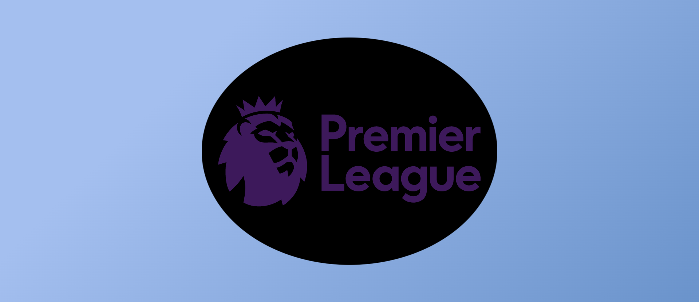
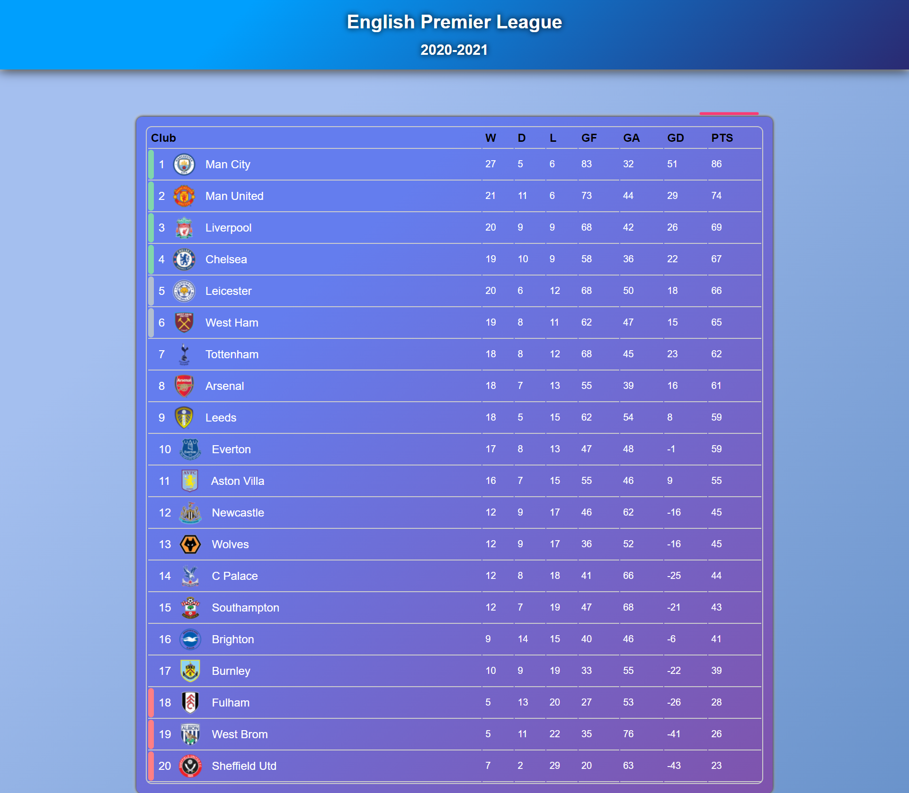

# Basil-Api-Task
## English Premier League
## CHECKIT [HERE](https://gsg-cf05.github.io/Basil-Api-Task/)

## Discreption
This Project For English Premier League Standings In 2020-2021 Season
First 4 Teams is Qulify To Champions League And First 2 Teams After The First 4 Teams It Qulify For Europe League And Last 3 Teams In This Standing It Relegation For FFL League Two.

## How Create It
- HTML5 & CSS3
- GIT & GITHUB
- RESPONSIVE WEB DESIGN
- JAVASCRIPT API

## Create [Basil](https://github.com/Bas-Shiekh)

## Final Result

- 
- 